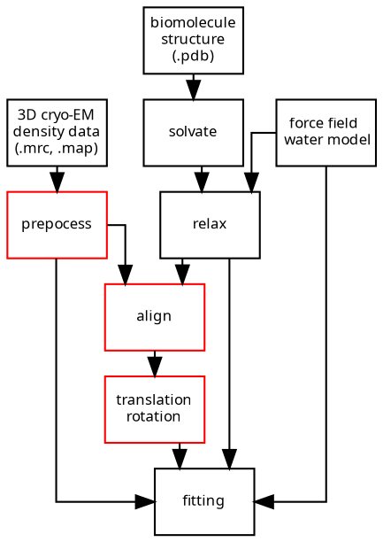

# Some thoughts on the road

---

## I Pipelines for cryo-EM refinement

---

### It just works?

---

---

name tools / design principles
explain fit workings
show fit results
show downsampled results

show mdpeditor

---

## What is a cryo-EM density?

> What is rational is real; And what is real is rational.
[name=cfh]

---

## 

> Any relationships between numbers, functions, and operations become transparent, generally applicable, and fully productive only after they have been isolated from their particular objects and been formulated as universally valid concepts[name=emmy noether]

---
> if density and diversity give life, the life they breed is disorderly.[name=jane jacobs]

---

